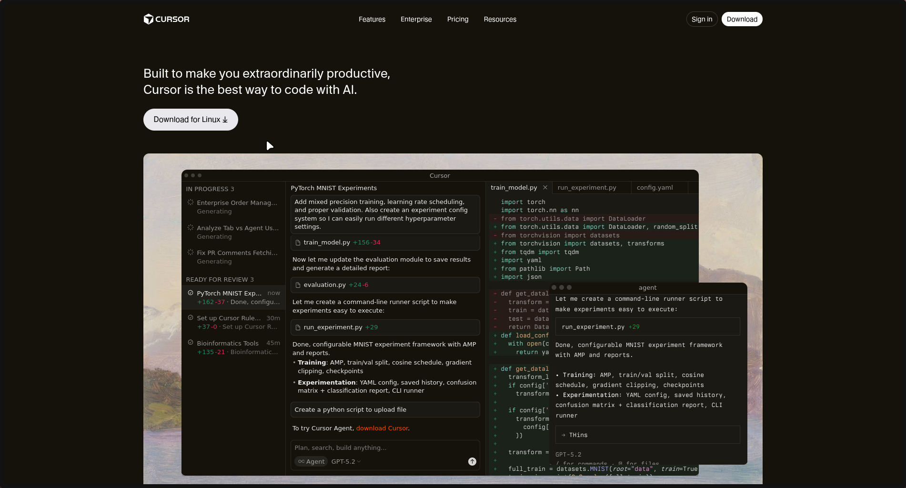
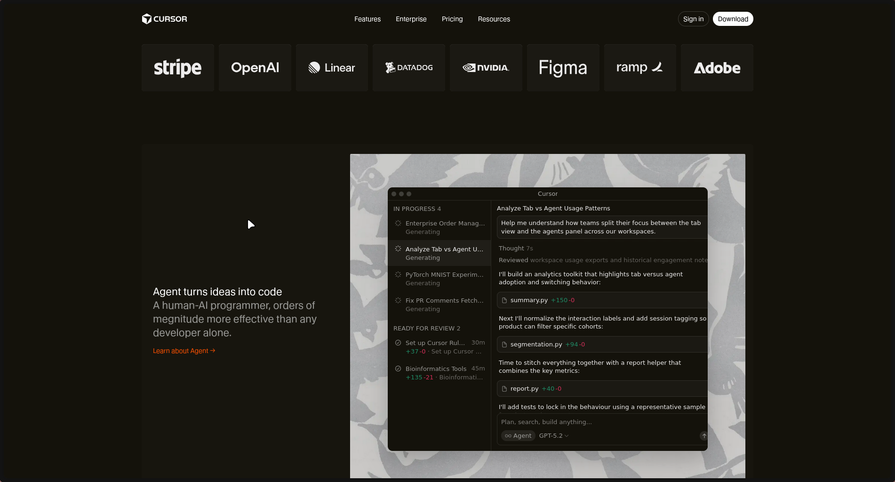

# Cursor Landing Page clone 
- Create with html and css only.

## How to setup this project locally ? 
- Run this following command into your terminal: 
`git clone https://github.com/Thebeast01/dev-tool-landing-page.git`
- Once repo is cloned just run the project with live server:
-Font family : CursorGothic
-Color : 
- #ebecec
- bg-color: #14120B;
- accent-button: #f54e00;
- feature-card-bg-color: #1b1913;
- Footer section background color : #26241E
- Theme Container Color : #3A3933
### Thank you for visiting....
